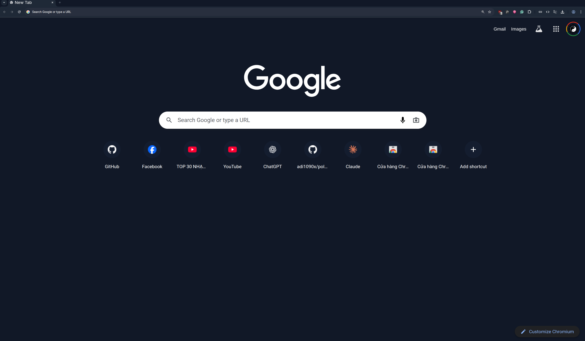

# My theme design with template of tundra

## Screenshot



## Installation

1. Git clone this repo

```bash
git clone https://github.com/baiyuechuu/chromium-theme.git
```

2. Open `chrome://extensions/` in your browser

3. Enable `Developer mode` at the top right corner

4. Click `Load unpacked` and select the folder `tundra` in themes folder

